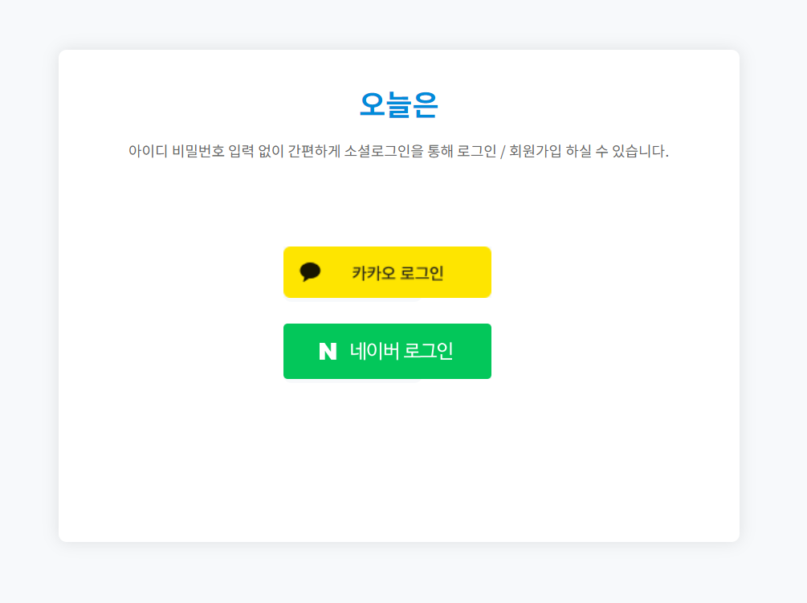
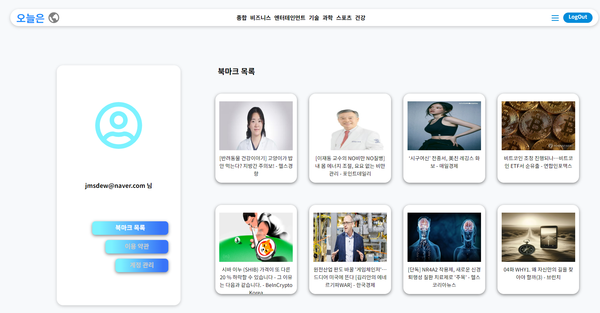

# 오늘은 - React Web
React를 사용하여 구현되었으며, 백엔드로부터 Kakao와 Naver AccessToken을 받아  로컬 스토리지에 저장하고, 접속 시마다 토큰의 유효성을 검사하여  로그인 상태를 유지하는 기능을 포함합니다.  또한, 뉴스마다 댓글 기능, 공지사항 조회, 1대1 문의 작성 기능이 있으며,  어드민 페이지에서는 유저 관리, 뉴스 내용 수정/삭제, 댓글 조회/삭제,  1대1 문의 답글 작성, 공지사항 작성 기능이 구현되어 있습니다.

## 기능

1. 로그인 및 로그인 상태 유지
- 백엔드로부터 Kakao와 Naver AccessToken을 받아 로컬 스토리지에 저장합니다.
- 접속 시마다 토큰의 유효성을 검사하여 로그인 상태를 유지합니다.
2. 뉴스마다 댓글 기능
- 각 뉴스에 대해 댓글을 작성할 수 있습니다.
3. 공지사항 조회
- 공지사항 목록을 조회할 수 있습니다.
4. 1대1 문의 작성
-  관리자에게 1대1 문의를 작성할 수 있습니다.

5. 어드민 페이지 기능

- 유저 관리: 유저의 정보를 조회하고 수정/삭제할 수 있습니다.
- 뉴스 내용 수정/삭제: 뉴스 내용을 수정하거나 삭제할 수 있습니다.
- 댓글 조회/삭제: 댓글을 조회하고 삭제할 수 있습니다.
- 1대1 문의 답글 작성: 유저의 1대1 문의에 답글을 작성할 수 있습니다.
- 공지사항 작성: 새로운 공지사항을 작성할 수 있습니다.

## 사용된 기술 스택
- React
- ZuStand (상태 관리)
- React Router (라우팅)
- Fetch 
- Vercel (CICD)

## CI/CD 구축
이 프로젝트는 Vercel을 사용하여 CI/CD를 구축하였습니다.  GitHub 저장소와 연동되어, 새로운 커밋이 푸시될 때마다 자동으로 빌드 및 배포되어 최신 버전의 웹 페이지를 제공합니다.

